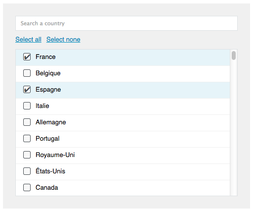

# react-select-multiple

**A ReactJS component to render a multiselect (with a filter).**

This component creates a list of checkboxes to select options.
Behind the scenes an hidden tag `<select>` is updated with your selected options.



## Installation

Install `react-select-multiple` with [npm](https://www.npmjs.com/):

```
$ npm install react-select-multiple
```

For [CommonJS](http://wiki.commonjs.org/wiki/CommonJS) users:

```javascript
var Multiselect = require('react-select-multiple');
```

## Options

* **list (required) [array]:** the initial list of options as an array of objects like that:

```javascript
[
    {value: "FR", title: "France"},
    {value: "BE", title: "Belgique"},
    {value: "ES", title: "Espagne"},
    {value: "IT", title: "Italie"},
    {value: "DE", title: "Allemagne"}
]
```

* **selectors [bool]:** if set to true, it display links to select all/none options
* **selectAllLabel [string]:** the "select all" label
* **selectNoneLabel [string]:** the "select none" label
* **checkedByDefault [array]:** a list of preselected options. Example:

```javascript
[
    {value: "BE", title: "Belgique"},
    {value: "ES", title: "Espagne"}
]
```

* **filterPlaceholder [string]:** a placeholder for the input filter

## Demo

Clone the repository and move into:

```console
$ git clone git@github.com:AdeleD/react-select-multiple.git
$ cd react-select-multiple
```

Open the file [example/index.html](https://github.com/AdeleD/react-select-multiple/blob/master/example/index.html) to see the result.
